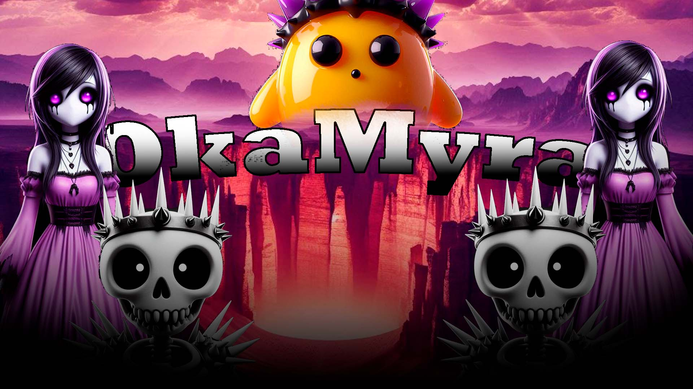
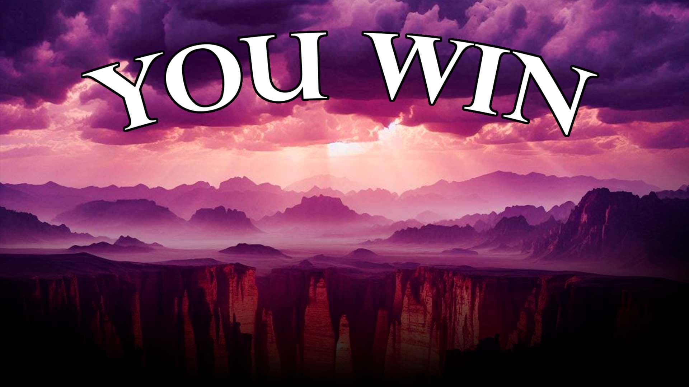
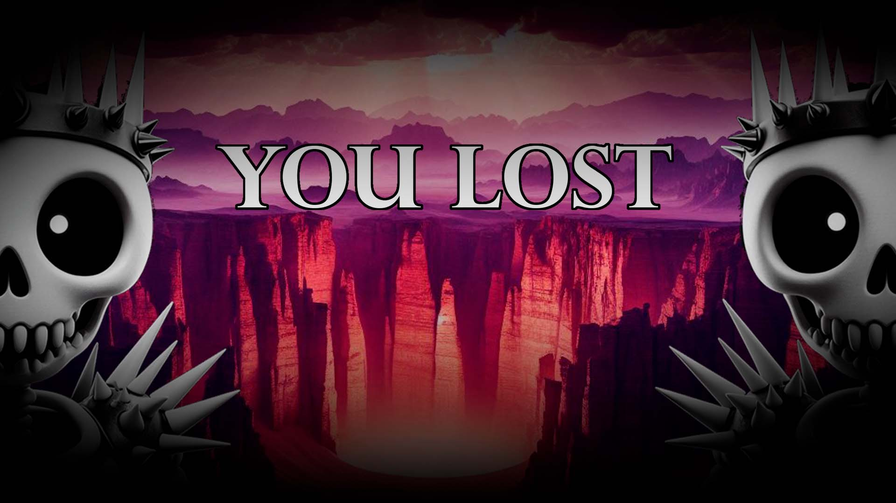
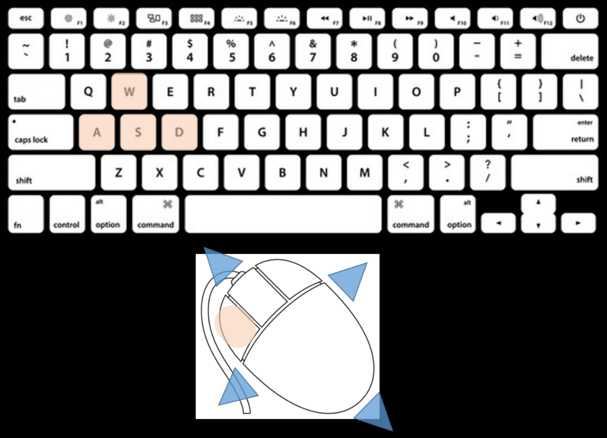
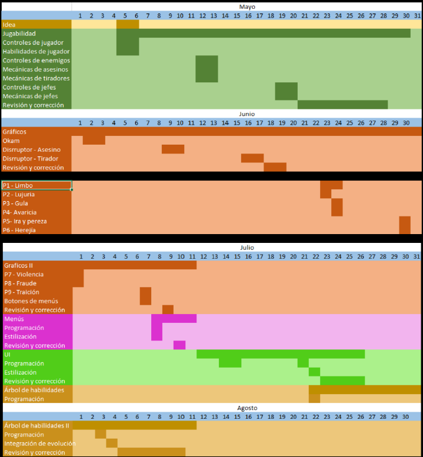

# ✨OKAMYRA✨ #
--------------------

**🔥Desarrollador:🔥**

- Arzate Camahco Emmanuel - OkamatlOrion

--------------------
[Añade una imagen de tu juego.]: #

--------------------
# 🎮 Instrucciones de uso 🎮 #
[Describe cómo ejecutar el proyecto: versión de Unity, plataforma objetivo, controles, etc.]: #

- Unity versión: 2022.3.x LTS
- Plataforma: Navegador
- Controles: Teclas W, A, S, D, para caminar, mouse para apuntar, boton izquierdo del mosue para disparar.

----------------------
# 💓Tabla de evaluacion:💓 #
| Nombre | Colaboracion | Comunicacion | Responsabilidad
| ----------- | ----------- | ----------- | ----------- |
| ACE| 	9|	10| 9	|

------------------------

# ✨1. Propósito del juego✨ #
---------------------------
##  🔥1.1. Resumen del juego:🔥  ##

⚔️ El juego será un Soulslike tipo FPS, con dos estilos artísticos (El personaje principal y los enemigos serán tiernos mientras que el escenario de combate será demoniaco).
👽 Se utilizarán modelos 3D, los cuales se animaran y posteriormente se convertiran en sprites 3D para su renderizado en el juego.
✨ Al inicar aparecerá en una mazmorra habitada por una reina, quien invocará criaturas, con el fin de atacar aljugador, quien deberá atacarla con bolas de fuego para poder escapar de ese lugar.
➡️ El jugador podrá desplazarse con las teclas W, A, S, D, evadir y eliminar a los enemigos.

----------------------------------

## 📜1.2. Resumen de la historia del juego📜 ##

🐈 Okam, un tierno gato, mascota de un hechizero a caido en una mazmorra demoniaca mientras su amo practicava un antiguo ritual. 
🌅 Ahora debe buscar la forma de salir de ese lugar utilizando los conocimientos mágicos que aprendió de su dueño, enfrentandose con criaturas que jamas se habría imaginado.

-----------------------------------

## 🎯1.3. Objetivo del juego🎯 ##

- ⚔️El juego tiene como objetivo escapar de la mazmorra, lo cual se consigue eliminando a la jefa.
> - La jefa invoca mounstros repetidamente.
> - Los mounstros atacan al jugador sin descanso.
> - El jugador debe decidir si eliminar a los mounstros en su campo de visión, atacar ala jefa directamente o escapar.
- 🧠 El juego busca poner a prueba las habilidades del jugador para:
> - Coordinar ojos y manos (Para poder atacar y moverse sin complicación)
> - Toma de deciciones (Decidir si es mejor atacar al jefe, atacar a los enemigos o alejarse para buscar un mejor ángulo)
> -  Reacción (Para esquivar a los enemigos que aparescan enfrente de él)

-------------------------------

## 🕹️2. Jugabilidad🕹️ ##

- ⬆️ Teclas W, A, S, D, para moverse dentro de la escena
- 🐭 Movimiento del mouse para apuntar las bolas de fuego
- 🔥 Click izquierdo del mousepara disparar las bolas de fuego
---------------------------------

## 🪐3. Mundo del juego🪐 ##

- 🕹️ El GamePlay se desarrolla en una mazmorra obscura, llena de criaturas terribles.
- 💀 Los enemigos básicos "Disrruptores" tendrán colores más visiblesque le faciliten la visión al jugador.
- 😈 La jefa tendrá colores más obscuros, lo cual obligará al jugador a prestar más atención para ubicar y acabar con su enemigo principal.
- 🌆 Los escenarios y enemigos se modelarán y animarán en 3D, para posteriormente exportar esas animaciones en una secuencia 2D, dando al mundo un acabado de mayor calidad sin sacrificar el rendimiento de las máquinas.

---------------------------------

## 🆚4. Mecánicas del juego🆚 ##

🎯 El jugador tendrá un objetivo:Sovrevivir a las hordas de enemigos.
👿 La complejidad del juego dependerá de su habilidad para moverse en el escenario, atacar a los "Disrruptores" y atacar a la jefa sin descuidar sus propios puntos de vida.
⌛ Mientras más tiempo pase jugando más enemigos aparecerán y sele complicará abrirse paso para alcanzar su objetivo.

---------------------------------

## 👷‍♀️5. Personajes👷‍♀️ ##

- 😼 Okam: Personaje principal
> - Gatito tierno con sombrero de mago y una bola de fuego siempre a su lado.
> - Podrá caminar (teclas W, A, S, D), apuntar su bola de fuego (movimiento del mouse) y disparar bolas de fuego (presionando “el botón izquierdo” del mouse).

- 💀 Disrruptores: Enemigos básicos
> - Esqueleto blanco con corona de espinas negra y una daga en cada mano.
> - Buscará y atacará al jugador en todo momento, daña al jugador en cuanto lo toca.

- 😈 Jefa: Enemigo especial
> - Demonio humanoide femenino, vestido rojo con blanco, cabello largo negro con alas blancas a sus espaldas.
> - Se quedará quieta en su lugar mientras invoca "Disrruptores" sin parar.

------------------------

## ✨6. Plan de proyecto✨ ##

- 💡 Idea
> - Generar las ideas y buscar los posibles inconvenientes antes de empezar el diseño del juego
- 🕹️ Jugabilidad
> - Diseñar y programar las habilidades del jugador, enemigos y jefes.
- 🌆 Gráficos
> - Diseño de los modelos en 3D para los escenarios, personajes, habilidades y menús.
> - Transformación de las animaciónes 3D a 2D por medio de photoshop para implementar graficos realistas al juego sin dañar el rendimiento.
> - Se espera diseñar escenarios adicionales (Sujeto a los tiempos de entrega)
- ♦️ Menús
> - Programación e implementación del código para hacer funcionar los emnús detro del juego.
- ✨ UI
> - Programación y estilización de la interfaz del usuario (vida del jugador y vida del enemigo).
- 🎄 Arbol de habilidades
> - Según los tiempos de entrega se espera diseñar un árbol de habilidades (Sujeto a los tiempos de entrega)

-------------------------

## 🔥7. Bibliografía🔥 ##

- Por qué “La divina comedia” sigue siendo tan relevante 700 años después de la
muerte de Dante. (2021, agosto 1). BBC. https://www.bbc.com/mundo/noticias57936063
- Romero, S. (2023, abril 10). Los círculos del infierno de Dante: significado y
simbolismo en la Divina Comedia. Muy Interesante.
https://www.muyinteresante.com/historia/35949.html
- The binding of Isaac en steam. (s/f). Steampowered.com. Recuperado el 26 de
mayo de 2025, de
https://store.steampowered.com/app/113200/The_Binding_of_Isaac/?l=spanish

