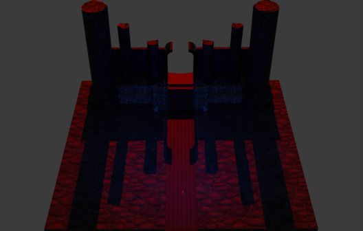

# ✨OKAMYRA✨ #
--------------------

**🔥Desarrollador:🔥**

- Arzate Camahco Emmanuel - OkamatlOrion

--------------------
[Añade una imagen de tu juego.]: #

--------------------
# 🎮 Instrucciones de uso 🎮 #
[Describe cómo ejecutar el proyecto: versión de Unity, plataforma objetivo, controles, etc.]: #

- Unity versión: 2022.3.x LTS
- Plataforma: Navegador
- Controles: Teclas W, A, S, D, para caminar, mouse para apuntar, boton izquierdo del mosue para disparar.

----------------------
# 🔥Tabla de evaluacion:🔥 #
| Nombre | Colaboracion | Comunicacion | Responsabilidad
| ----------- | ----------- | ----------- | ----------- |
| ACE| 	9|	10| 9	|

------------------------

# ✨1. Propósito del juego✨ #
---------------------------
##  1.1. Resumen del juego:  ##

El juego será un Soulslike tipo FPS, con dos estilos artísticos (El personaje principal y los enemigos serán tiernos mientras que el escenario de combate será demoniaco).
Se utilizarán modelos 3D, los cuales se animaran y posteriormente se convertiran en sprites 3D para su renderizado en el juego.
Al inicar aparecerá en una mazmorra habitada por una reina, quien invocará criaturas, con el fin de atacar aljugador, quien deberá atacarla con bolas de fuego para poder escapar de ese lugar.
El jugador podrá desplazarse con las teclas W, A, S, D, evadir y eliminar a los enemigos.

----------------------------------

## 1.2. Resumen de la historia del juego ##

Okam, un tierno gato, mascota de un hechizero a caido en una mazmorra demoniaca mientras su amo practicava un antiguo ritual. 
Ahora debe buscar la forma de salir de ese lugar utilizando los conocimientos mágicos que aprendió de su dueño, enfrentandose con criaturas que jamas se habría imaginado.

-----------------------------------

## 1.3. Objetivo del juego ##

El jugador deberá guiar a Okam por las diferentes mazmorras, haciendo uso del teclado y ratón, recolectando:
- Oro – Le servirá para poder revivir sin perder sus cosas tras un “descenso” fatídico.
- Materiales – Le permitirá craftear: armas, armaduras y amuletos, que mejorarán sus estadísticas.
La experiencia principal tendrá una duración aproximada de 1 hora, tras lo cual el jugador podrá seguirse retando a sí mismo mediante logros, instándole a obtener todas las armas, escudos, amuletos y potenciadores. Al conseguir un logro obtendrá recompensas como:
- Ahorrador: Al tener 1,000 piezas de oro sin gastar en su monedero se le activará de forma permanente un multiplicador x2 para las piezas de oro que consiga a partir de la activación del logro.
- Armero: Al conseguir un equipamiento completo de algún elemento (luz u obscuridad) obtendrá una bonificación +5 permanente en todas sus estadísticas.
Los escenarios dependerán de la mazmorra “Circulo del infierno” en el que se encuentren:
- Limbo: Será la casa de la “mascota” Okam, aquí todo será lindo y tierno.
- Lujuria: El segundo círculo “mazmorra” Las paredes y piso tendrán manchas blancas y rojas, soportes para látigos y grilletes.
- Gula: El tercer círculo “mazmorra” tendrá hornillas en el suelo, refrigeradores en las paredes y charcos de aceite esparcidos.
- Avaricia: El cuarto circulo “mazmorra” tendrá pizos y paredes doradas, tronos de reyes y pilares de hormigón blanco.
- Ira y pereza: El quinto círculo “mazmorra”, tendrá paredes y pisos de roca volcánica, pilares de lava y hogueras encendidas por los rincones.
- Herejía: El sexto circulo “mazmorra” será la imitación de un templo religioso, con un altar en el centro de la habitación, signos religiosos por todas las paredes y alfombras en el suelo.
- Violencia: El séptimo círculo “mazmorra” tendrá paredes desgastadas y grafiteadas, el suelo será negro, con contornos blancos de personas simulando escenas de crimen.
- Fraude: El octavo círculo “mazmorra” simulará una sala de tribunal.
- Traición: El noveno círculo “mazmorra” estará en tinieblas total, solo se podrán ver algunas antorchas y los ojos del jefe final.
En el primer círculo (la casa de Okam) se podrá interactuar con:
- Comida: Regenerará vida, proveerá escudos y dará efectos adicionales (resistencia, velocidad … )
- Yunque: Permitirá la creación y mejora de armamento.
- Árbol de habilidades: Permitirá mejorar las habilidades básicas y especiales.
En cuanto a habilidades, Okam poseerá básicas y especiales:
Básicas:
- Caminar: se puede evolucionar, obteniendo +5 de velocidad en cada nivel.
- Pegar: se puede evolucionar, obteniendo +5 de fuerza en cada nivel.
- Dash: no se puede evolucionar
Especiales:
- Robo de energía: habilidad recargable con el tiempo y activable con el teclado.
Genera daño en área instantáneo, justo donde esté Okam, según el daño ejercido a los enemigos, Okam recarga más rápido “Robo de energía” y “Drenado” (se puede evolucionar, obteniendo +2 de rango y +2 de daño en cada nivel.)
- Drenado: habilidad recargable con el tiempo y activable con el teclado.
Genera daño en área prologado, que se mueve junto con Okam. Según el daño ejercido a los enemigos, le permite a Okam regenerar un porcentaje de su vida, (se puede evolucionar, obteniendo +2 de rango y +1 de daño en cada nivel.)

-------------------------------

## 2. Jugabilidad ##

Controlable con teclado y mouse.

---------------------------------

## 3. Mundo del juego ##

El entorno se adaptará según el piso “mazmorra” en el que se encuentre el jugador, transmitiendo la emoción de los pecados tanto en lo visual como en lo auditivo.

---------------------------------

## 4. Mecánicas del juego ##

El jugador recibirá instrucciones de la mascota “Okam” quien le enseñara a jugar.
En el primer piso “mazmorra” (La casita de Okam), Okam le explicará como cuidar de él: alimentándolo, enseñándole a craftear armamento, utilizar las misiones y mostrándole como evolucionarlo. Todas estras instrucciones de le mostrarán por medio de globos de dialogo, los cuales desaparecerán cuando el jugador complete la acción.
No se podrá interactuar con los enemigos menores. Sin embargo al iniciar y terminar la batalla con el jefe, se activarán burbujas de dialogo preestablecidas, no seleccionables, que le permitirán al jugador entender porque Okam está aprisionado. Estas burbujas desaparecerán al dar clic en un botón.
La sección de misiones tendrá lugar en el primer piso, en una de las habitaciones de Okam, donde se mostrarán las misiones cumplidas y las que estén en curos, además de los potenciadores que ya se hayan recibido. Para impulsar al jugador, las misiones vendrán acompañadas de beneficios (mejora de fuerza, duplicador de oro, efecto de habilidad), los cuales se le otorgarán al jugador cuando complete alguna de las misiones.

---------------------------------

## 5. Personajes ##

- Okam: Personaje principal
Mascota pequeña, tierna, pachoncita de colores amarillos y verdes.
Podrá caminar (moviendo el mouse), hacer dash (con la tecla “Shift”), y pegar con
armas mele (presionando “botón el botón izquierdo” del mouse).
- Habilidades especiales:
Robo de energía: Activable con la tecla “W” genera un área de daño instantánea
alrededor de él. Su animación simulará el impacto de un relámpago en el suelo.
Drenado: Activable con la tecla “E” genera un área de daño alrededor de él que
le sigue durante 4segundos. Su animación simulará un remolino de agua
electrificado.
 Disrruptores: Enemigos básicos
Criaturas negras de ojos rojos y dientes afilados. (Los asesinos tendrán un aspecto
humanoide. Los Tiradores tendrán un aspecto de fantasma sin piernas)
Su función será buscar y atacar a Okam en cuanto este se encuentre en su rango de
visión. Serán capaces de caminar y atacar, según su clase:
- Asesino: ataque cuerpo a cuerpo, empuñarán dagas. Su ataque será rápido, por
lo que su animación tendrá un efecto barrido. (Este enemigo buscará acercarse
todo el tiempo al jugador, acortando la distancia en cada enfrentamiento)
- Tirador: Ataque a distancia, empuñará un arco. Su ataque será tardío, por lo que
su animación mostrará como recarga y apunta su arma antes de disparar. (Este
enemigo buscará mantener distancia con el jugador, acercándose a él para entrar
en rango de ataque y alejándose de él cuando este en rango de riesgo)
 Protectores: Jefes de pisos “mazmorras”
Estos enemigos estarán esperando al jugador al final de cada mazmorra.
Tendrán un aspecto humanoide, muy luminoso, como si emanaran luz propia.
Cuatro veces más grandes y delgados que Okam y los disrruptores.
- Habilidad básica: Atacará a Okam con velocidad desde la distancia a la que esté.
Su animación tendrá un efecto de barrido.
- Habilidad especial: Invocará disrruptores. Su animación hará que levante las
manos, obligándolo a quedarse en su lugar, mientras invoca una horda de
disrruptores (combinará los dos tipos de disrruptores) Tras lo cual se quedará
vulnerable y débil.

------------------------

## 6. Plan de proyecto ##

- Diagrama de Gantt

- Monetización: El videojuego será gratuito, sin embargo se permitirán micro
transacciones que les permitirá a los jugadores comprar materiales específicos
(que también se podrán obtener jugando) para poder craftear nuevas herramientas
o mejorar las que tengan. No se venderán herramientas ya crafteadas.
Además se permitirá la visualización de anuncios para obtener “oro” (este
permitirá ingresar a las mazmorras y revivir sin perder todas sus cosas)

-------------------------

## 7. Bibliografía ##

- Por qué “La divina comedia” sigue siendo tan relevante 700 años después de la
muerte de Dante. (2021, agosto 1). BBC. https://www.bbc.com/mundo/noticias57936063
- Romero, S. (2023, abril 10). Los círculos del infierno de Dante: significado y
simbolismo en la Divina Comedia. Muy Interesante.
https://www.muyinteresante.com/historia/35949.html
- The binding of Isaac en steam. (s/f). Steampowered.com. Recuperado el 26 de
mayo de 2025, de
https://store.steampowered.com/app/113200/The_Binding_of_Isaac/?l=spanish

